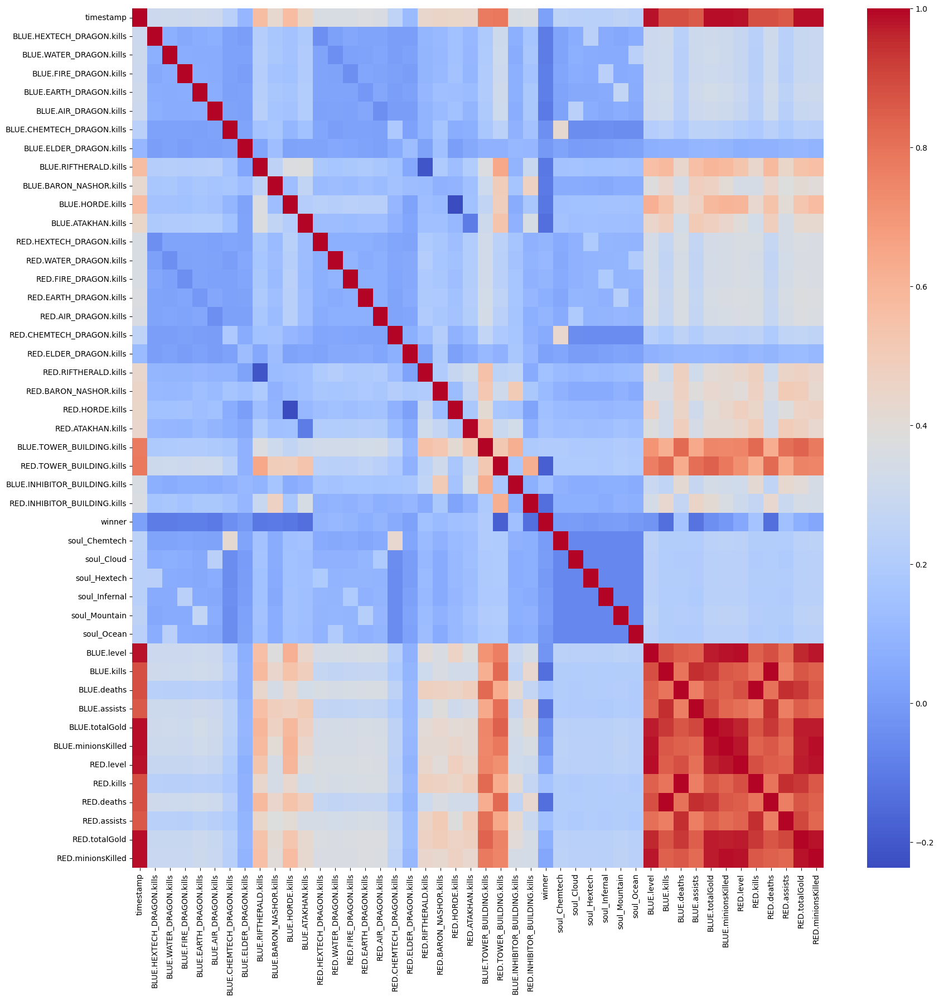
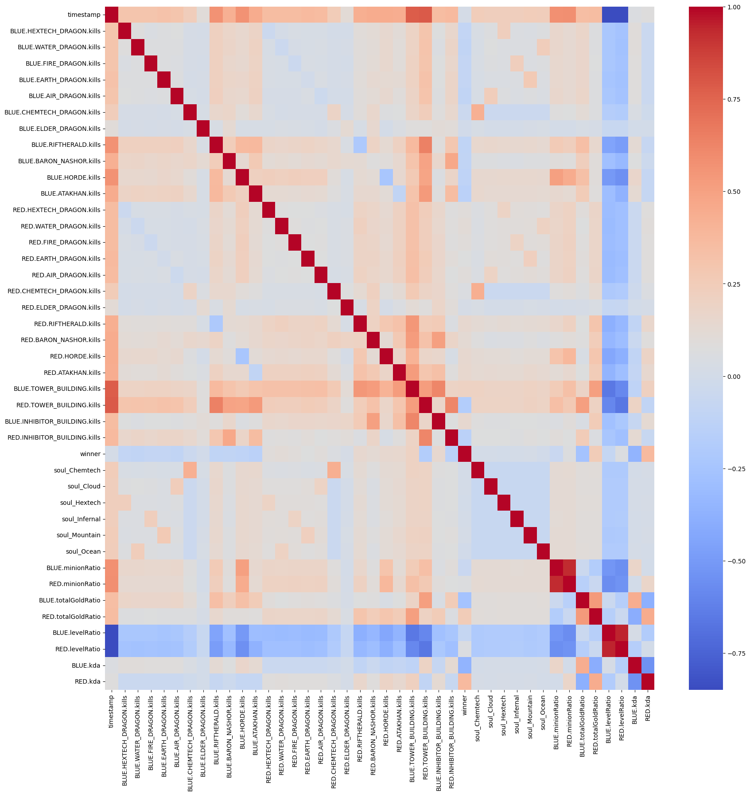
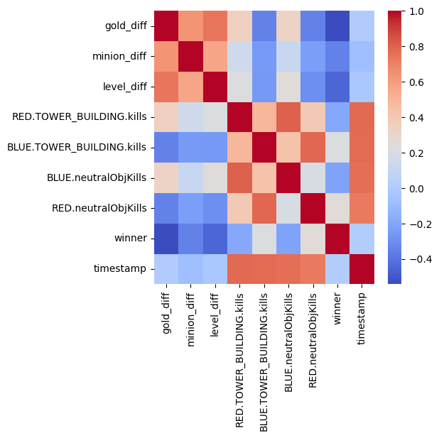
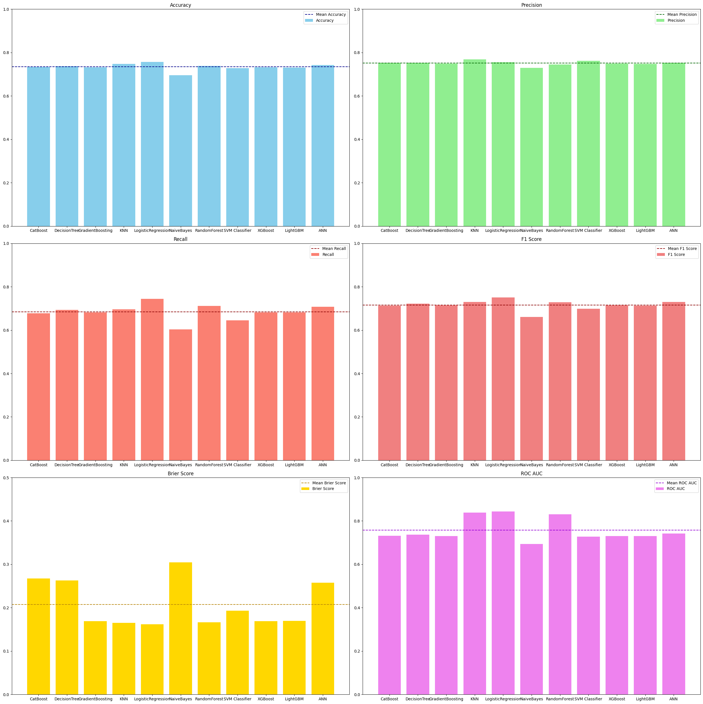
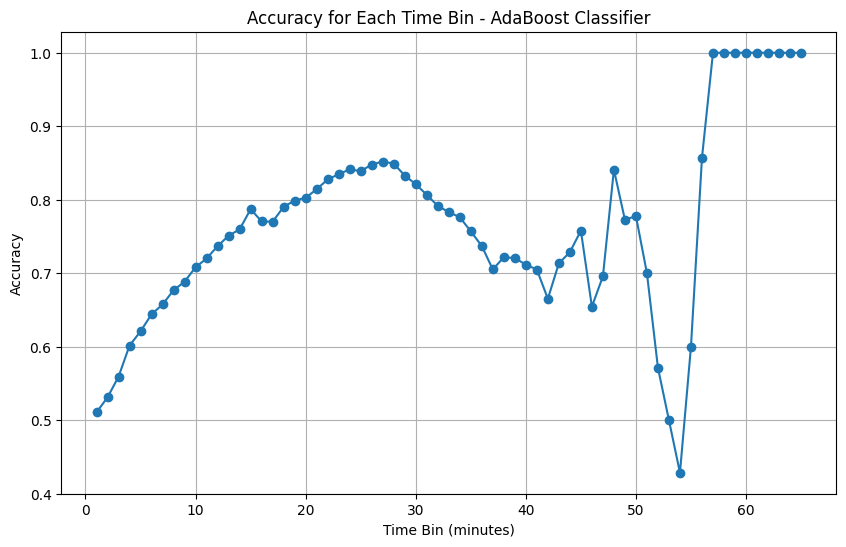
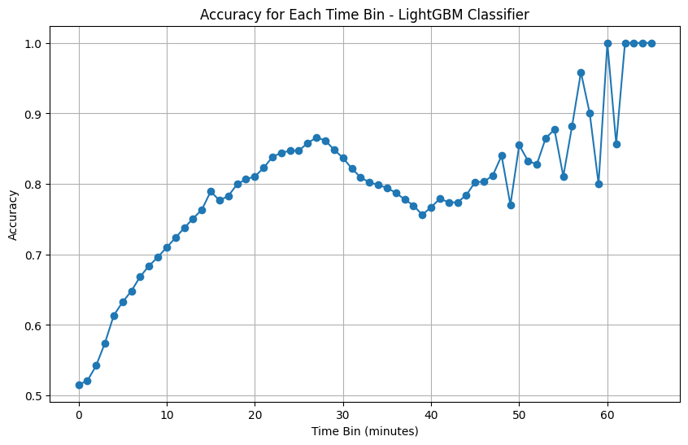
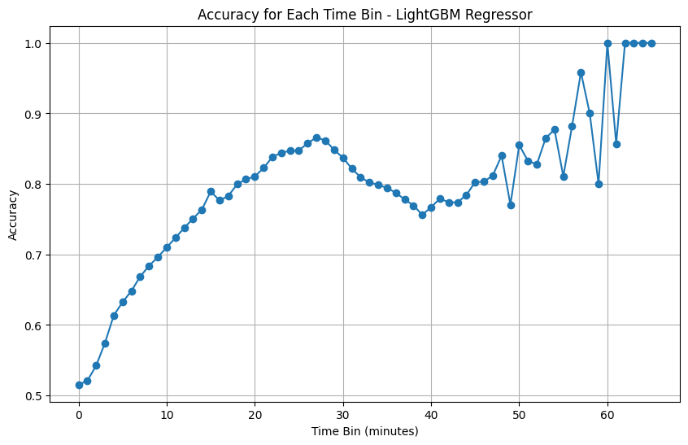
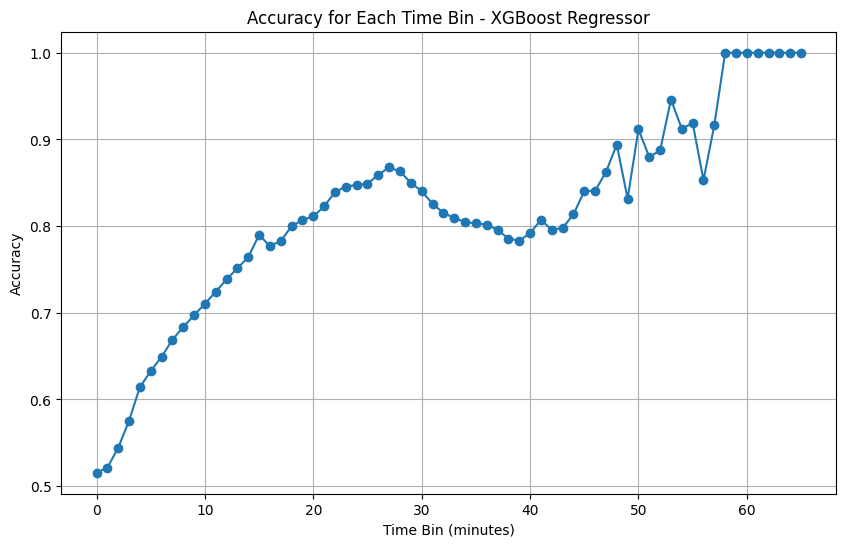
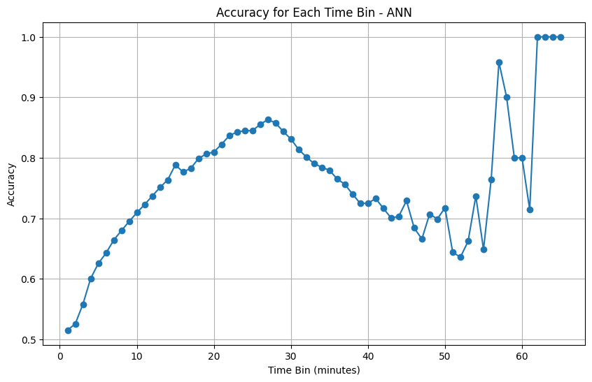

# Benchmarking Models for Predicting League of Legends Game Outcomes

## 1. Introduction

### 1.1 Objective
The objective of this project is to benchmark various machine learning models to predict the outcome of League of Legends (LoL) games using in-game data. The goal is to identify the most accurate and efficient model for predicting game outcomes based on features such as the number of kills, gold earned, and other relevant in-game statistics.

### 1.2 Context
League of Legends is a multiplayer online battle arena (MOBA) game in which two teams, the blue team and the red team, compete against each other. The game features three lanes, a jungle area, and five distinct roles for players. The primary objective is to destroy the opposing team's Nexus to secure victory.

### 1.3 Feasibility
To ensure the project feasibility, a Proof of Concept (PoC) has been realized and is accessible on GitHub [here](https://github.com/YoungSnoww/poc-lol-prediction/tree/main).

### 1.4 Group Composition
The project will be conducted by a group of 5 people, each responsible for different aspects of the benchmarking process, including data preprocessing, model training, evaluation, and documentation.

- Valentin Woehrel - vw207@kent.ac.uk
- Quentin Erdinger - qe3@kent.ac.uk
- Simon Bandiera - sb2440@kent.ac.uk
- Hugo Galan - hg310@kent.ac.uk
- Timothée Lesellier, PM - tl456@kent.ac.uk

----

## 2. Datasets

### 2.1 Data Source
This dataset was created by scraping the official RIOT API. The data is composed of 200,000 games with 109 features each. The features include in-game statistics such as kills, deaths, assists, gold earned, and other relevant information.

### 2.2 Data Access
The dataset can be accessed via the following URL: [Dataset URL](https://epitechfr-my.sharepoint.com/:f:/g/personal/hugo_galan_epitech_eu/Ersjm19Jx6dJroDmOviZyssBvaW9g4kKFzqm0-2fxcz46A?e=NW2ezW)

---

## 3. Models to Benchmark

### 3.1 Model List
The following models will be benchmarked to predict the outcome of LoL games:
1. **Logistic Regression**: A baseline model to establish a performance benchmark.
2. **Decision Trees**: To capture non-linear relationships in the data.
3. **Random Forest**: An ensemble method to improve the performance of decision trees.
4. **Gradient Boosting Machines (GBM)**: Including XGBoost and LightGBM for robust performance.
5. **Support Vector Machines (SVM)**: With different kernel functions to handle complex data patterns.
6. **Neural Networks**: Including Multi-Layer Perceptrons (MLP) and Convolutional Neural Networks (CNN) for capturing intricate data relationships.
7. **k-Nearest Neighbors (k-NN)**: To evaluate the performance of instance-based learning.
8. **Naive Bayes**: To assess the performance of probabilistic classifiers.
9. **AdaBoost**: An ensemble method to boost the performance of weak classifiers.
10. **CatBoost**: A gradient boosting library that handles categorical features efficiently.
---

## 4. Evaluation Metrics

### 4.1 Metrics List
The performance of each model will be evaluated using the following metrics:
- **Accuracy**: The proportion of correctly predicted game outcomes.
- **Precision**: The proportion of correctly predicted positive outcomes (wins) out of all predicted positive outcomes.
- **Recall**: The proportion of correctly predicted positive outcomes out of all actual positive outcomes.
- **F1-Score**: The harmonic mean of precision and recall.
- **AUC-ROC**: The area under the Receiver Operating Characteristic curve to evaluate the model's ability to distinguish between positive and negative outcomes.
- **Confusion Matrix**: To visualize the performance of the model in terms of true positives, true negatives, false positives, and false negatives.
- **Brier Score**: Added later to reduce the difference bewtween Classifier and Regressor, the mean squared difference between predicted probabilities and the actual outcomes.

---

## 5. Methodology

### 5.1 Data Gathering

We started by collecting the data from the RIOT API. In details, the data was made of games from the best ranking Tiers made of 1. Challenger, 2. GrandMaster, 3. Master. In total we got 6 587 262 games with 109 features each. The features include in-game statistics such as kills, deaths, assists, gold earned, and other relevant information.

### 5.2 Data Preprocessing
- Clean and preprocess the dataset to handle missing values, outliers, and normalize the features.

Now having the data, we had to preprocess it. We started by encoding the different labels using a `LabelEncoder` from `sklearn.preprocessing`. Then boolean values were converted to integers.

### 5.3 Feature Engineering
- Create new features that may improve the predictive power of the models.

After the data processing we started by creating new features representing the mean of features from each team such as:
- `level`: made of the mean of each player's level.
- `kills`: made of the mean of each player's kills.

The purpose of this was to give us a better general idea of the game while reducing the number of features.

**Note**: The features were created for each team, blue and red; `{blue, red}.levels`, `{blue, red}.kills`, etc.

Then we created ratio features such as:
- `minionRatio`: The ratio of each team's minions killed.
- `totalGoldRatio`: The ratio of each team's total gold earned.
- `levelRatio`: The ratio of each team's level over time.
- `kda`: The ratio of each team's kills, deaths, and assists.

At the end of the end of the process we had 42 features. Allowing us to have a better understanding of the game and the players while reducing the number of features.

**Correlation Matrix Before**:

**Correlation Matrix After**:

### 5.4 Model Training
- Train each model using the preprocessed dataset.
We had to train 10 models to compare them. The training process was overall the same for each model. We started the process by doing some more feature engineering if needed. Then we split the data into training and testing sets using `train_test_split` from `sklearn.model_selection`. The training tests were made of 80% of the data and the testing set of 20%.

During the training process, we used the following steps:

1. **Model Training**: Using the splitted data, we trained the model using the training set. Then the model was evaluted to see its "default" performance.
2. **Hyperparameter Tuning**: We performed hyperparameter tuning using `GridSearchCV` from `sklearn.model_selection` to find the best hyperparameters for each model.
3. **Model Evaluation**: We evaluated the model using the testing set and the metrics defined in the previous section.

Now it is important to talk about the issue encountered during the training process. The main issue was the time needed to train some of the models, such as the **K-NN**, the **SVM**, also the **ANN**, leading the dataset to be rework to be less complex but still relevant.

New features were create, like `neutralObjkills` which was created to represent the number of neutral objectives killed by each team, `gold_diff`, `minion_diff`, and `level_diff`.
Those features were created to give us a better understanding of the game while reducing the number of features.

**New Correlation Matrix**:
)

To further reduce the time taken during the training process, we used **GPU** **implementation** for those models.

We then trained the model using the training set, performed hyperparameter tuning using `GridSearchCV` from `sklearn.model_selection`, and evaluated the model using the testing set

1. **Data Normalization**: We normalized the data using `StandardScaler` from `sklearn.preprocessing`.
2. **Model Training**: We trained the model using the training set.
3. **Hyperparameter Tuning**: We performed hyperparameter tuning using `GridSearchCV` from `sklearn.model_selection`.
4. **Model Evaluation**: We evaluated the model using the testing set and the metrics defined in the previous section.

**Note**: Each models training process can be seen in more details, see the `deep_learning` and `machine_learning` folders..

### 5.5 Evaluation
The evaluation was done using the metrics defined in the previous section.
Such as:
- **Accuracy**: The proportion of correctly predicted game outcomes.
- **Precision**: The proportion of correctly predicted positive outcomes (wins) out of all predicted positive outcomes.
- **Recall**: The proportion of correctly predicted positive outcomes out of all actual positive outcomes.
- **F1-Score**: The harmonic mean of precision and recall.
- **AUC-ROC**: The area under the Receiver Operating Characteristic curve to evaluate the model's ability to distinguish between positive and negative outcomes.
- **Brier Score**: The mean squared difference between predicted probabilities and the actual outcomes.
- **Confusion Matrix**: To visualize the performance of the model in terms of true positives, true negatives, false positives, and false negatives.

**Note**: For readability, the evaluation process of each model can be seen in the `deep_learning` and `machine_learning` folders. The confusion matrix of the models wil not be shown here, but can be found in the `deep_learning` and `machine_learning` folders.

### 5.6 Comparison
After having evaluated the models, we compared their performance using the metrics defined in the previous section. The comparison was done to identify the most accurate and efficient model for predicting LoL game outcomes.

The benchmarking of various machine learning and deep learning models for predicting League of Legends game outcomes has yielded insightful results. Here is a summary of the findings and conclusions:

#### Model Individual Performance

#### 1. CatBoost
- **Accuracy**: 0.7327
- **Precision**: 0.7529
- **Recall**: 0.6772
- **F1-Score**: 0.7130
- **AUC-ROC**: 0.7316
- **Brier Score**: 0.2673

#### 2. Decision Tree
- **Accuracy**: 0.7375
- **Precision**: 0.7524
- **Recall**: 0.6931
- **F1-Score**: 0.7216
- **AUC-ROC**: 0.7367
- **Brier Score**: 0.2625

#### 3. Gradient Boosting (XGBoost)
- **Accuracy**: 0.7317
- **Precision**: 0.7490
- **Recall**: 0.6811
- **F1-Score**: 0.7135
- **AUC-ROC**: 0.7307
- **Brier Score**: 0.1690

#### 4. Gradient Boosting (LightGBM)
- **Accuracy**: 0.7312
- **Precision**: 0.7475
- **Recall**: 0.6822
- **F1-Score**: 0.7134
- **AUC-ROC**: 0.7302
- **Brier Score**: 0.1694

#### 5. KNN
- **Accuracy**: 0.7477
- **Precision**: 0.7685
- **Recall**: 0.6953
- **F1-Score**: 0.7301
- **AUC-ROC**: 0.8384
- **Brier Score**: 0.1648

#### 6. Logistic Regression
- **Accuracy**: 0.7572
- **Precision**: 0.7555
- **Recall**: 0.7447
- **F1-Score**: 0.7501
- **AUC-ROC**: 0.8433
- **Brier Score**: 0.1616

#### 7. Naive Bayes
- **Accuracy**: 0.6958
- **Precision**: 0.7294
- **Recall**: 0.6035
- **F1-Score**: 0.6605
- **AUC-ROC**: 0.6940
- **Brier Score**: 0.3042

#### 8. Random Forest
- **Accuracy**: 0.7380
- **Precision**: 0.7450
- **Recall**: 0.7120
- **F1-Score**: 0.7280
- **AUC-ROC**: 0.8300
- **Brier Score**: 0.1663

#### 9. SVM Classifier
- **Accuracy**: 0.7274
- **Precision**: 0.7621
- **Recall**: 0.6457
- **F1-Score**: 0.6991
- **AUC-ROC**: 0.7274
- **Brier Score**: 0.1930

#### 10. ANN Classifier
- **Accuracy**: 0.7424
- **Precision**: 0.7530
- **Recall**: 0.7078
- **F1-Score**: 0.7297
- **AUC-ROC**: 0.7418
- **Brier Score**: 0.2576

#### Model Performance Overview

Based on the benchmarking results of various machine learning models for predicting League of Legends game outcomes, the following conclusions can be drawn:

1. **Overall** **Performance**:
Most models demonstrated strong performance, with accuracies ranging from 0.6958 to 0.7572. The Logistic Regression model stood out with the highest accuracy of 0.7572, closely followed by the KNN model with an accuracy of 0.7477.
The Naive Bayes model had the lowest accuracy at 0.6958, indicating it may not be the best choice for this prediction task.

2. **Precision** **and** **Recall**:
Precision values were generally high, with the SVM Classifier achieving the highest precision of 0.7621. However, the recall values varied more significantly. The Logistic Regression model had the highest recall of 0.7447, while the Naive Bayes model had the lowest recall of 0.6035.
The F1-Score, which balances precision and recall, was highest for the Logistic Regression model at 0.7501, followed by the KNN model at 0.7301. The Naive Bayes model had the lowest F1-Score of 0.6605.

3. **AUC-ROC**:
The AUC-ROC scores, which measure the model's ability to distinguish between positive and negative outcomes, were generally high. The Logistic Regression model had the highest AUC-ROC of 0.8433, followed by the KNN model at 0.8384. The Naive Bayes model had the lowest AUC-ROC of 0.6940.

4. **Brier** **Score**:
The Brier Score, which measures the mean squared difference between predicted probabilities and actual outcomes, was lowest for the Gradient Boosting models (XGBoost and LightGBM) at 0.1690 and 0.1694, respectively, indicating better calibrated predictions. The CatBoost model had the highest Brier Score of 0.2673.

### Recommendations:
- **Logistic Regression** is recommended as the best model for predicting League of Legends game outcomes due to its high accuracy, precision, recall, F1-score, and AUC-ROC, as well as its low Brier Score.
- **KNN** is also a strong candidate, particularly for its high AUC-ROC and competitive performance across other metrics.
- **Random Forest** can be considered for its balanced performance and high AUC-ROC.

These findings highlight the strengths and weaknesses of each model, providing a clear path forward for selecting the most accurate and reliable model for predicting game outcomes in League of Legends.

---

## 6. Conclusion

### 6.1 Summary of Findings

The benchmarking process of various machine learning models for predicting League of Legends game outcomes has provided valuable insights into the performance of each model. Here are the key findings from the benchmarking process:
- **Logistic Regression** emerged as the top-performing model, achieving the highest accuracy, precision, recall, F1-score, and AUC-ROC.
- **KNN** also demonstrated strong performance, particularly in terms of AUC-ROC, precision, and recall.
- **Random Forest** showed competitive performance across multiple metrics, making it a viable option for predicting game outcomes.

#### Key Takeaways:
- **Best Overall Performance**: Logistic Regression and KNN models showed the highest accuracy, precision, recall, F1-Score, and AUC-ROC.
- **Best Calibration**: Gradient Boosting models (XGBoost and LightGBM) had the lowest Brier Scores, indicating better-calibrated predictions.
- **Lowest Performance**: Naive Bayes had the lowest performance across most metrics, suggesting it may not be suitable for this task.
- **Balanced Performance**: Models like CatBoost, Decision Tree, and Random Forest showed balanced performance but did not excel in any particular metric.
- **Special Mention**: The ANN Classifier also performed well, with a good balance of accuracy, precision, recall, and F1-Score.

But, even though the findings are good, there is no huge difference in models performance, which leads us to predict the outcome of a game minute after minute and plotting the results to try and get more insight on the game.

When plotting the prediction minute after minute, the accuracy of the models are varying a lot, let's breaking it down:
- 1. **First minutes of the game**: The accuracy is close to random, this is because the game is still in the early stage and the outcome is still uncertain.
- 2. **Mid-game (around 20-30 minutes)**: The accuracy starts to increase as the game progresses and the outcome becomes more predictable. It is important to note that most games end around the 30-minute mark, which is reflected in the accuracy. It makes sense in itself since the diffference between the two teams is getting bigger and bigger.
- 3. **Late-game (after 30 minutes)**: The accuracy starts to decrease as the game reaches the late stage, where the outcome becomes more uncertain due to the catch-up mechanics and the potential for comebacks. There is the Elder Dragon which plays a huge role in this part of the game, the team which will complete this objective, by killing the dragon, will have a huge advantage over the other team in term of offensive power. Which can lead to a comeback.

### 6.2 Recommendations
Based on the work done, we can recommend the following:
- **Logistic Regression** is the best model for predicting League of Legends game outcomes due to its high accuracy, precision, recall, F1-score, and AUC-ROC.
- **KNN** is also a strong candidate, particularly for its high AUC-ROC and competitive performance across other metrics.
- **Random Forest** can be considered for its balanced performance and high AUC-ROC.

Further analysis could be done by adding more feature engineering to try and get more insight on the game. But there is a limit to what we can do, since the game is played by humans and the outcome can be unpredictable. There no way, for the moment, to get information on the players' mood, their communication, etc. Which can have a huge impact on the game.

## 7. Deliverables

### 7.1 Benchmarking Report
- This current report containing the benchmarking process, results, and conclusions.

### 7.2 Codebase
- A repository containing the code used for data gathering and preprocessing, model training, and evaluation.
